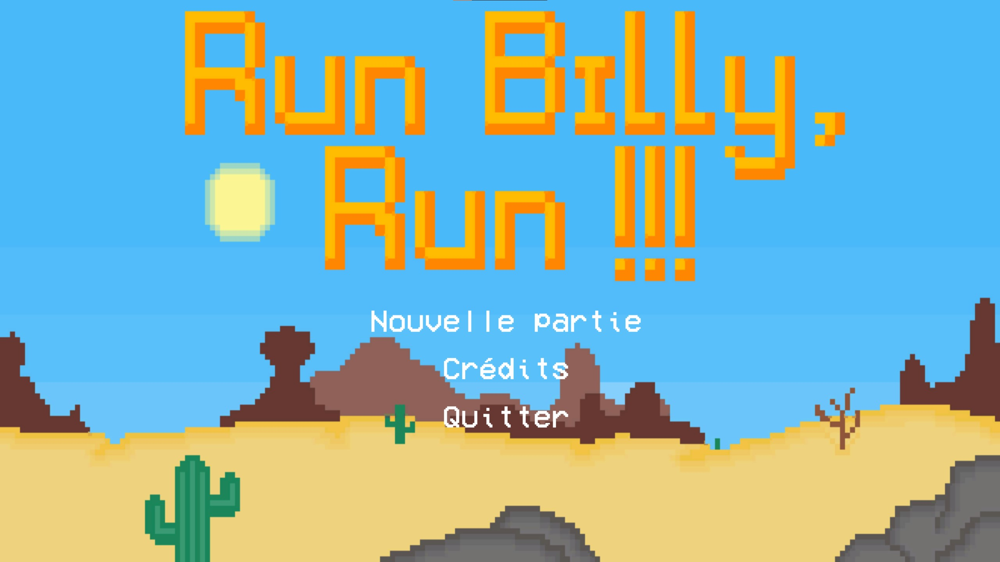

# Run Billy, Run!!!
**Author**: Damian Boquete Costa
**Last modification**: 10.07.2020

---

  

### Description
"Run Billy, Run!!!" is a 2D video game created as a final diploma project at ESIG. It draws strong inspiration from a mustached plumber whose name shall remain undisclosed. The game was developed using Unity and C# for the technical aspects. As for the graphics, they were created using the software Asprite, with my humble drawing skills taking part as well. The retro-style soundtrack is composed by Eric Skiff, who generously offers his excellent playlist for free.

A [user manual](ManuelUtilisateurV1.0.pdf) (in french) is available.

### How to run
1. Download the ENTIRETY of the folder corresponding to your platform (e.g., if you're using Windows, download the folder named "RBR_V1.0_WINDOWS").
2. Unzip it if necessary and place the folder wherever you prefer on your computer (e.g., on your desktop).
3. Enter the folder and launch the executable (the icon features a blue background with a taco on top of it).
4. Everything is ready. Good luck with the rest!